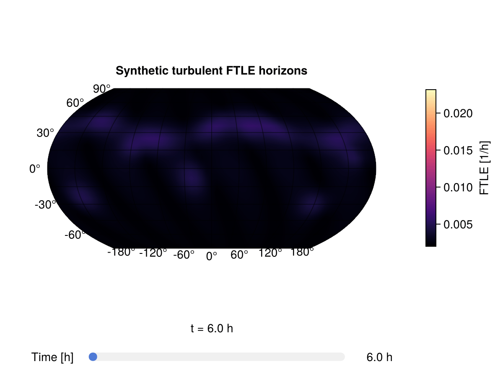

# Plotting

The plotting helpers convert FTLE vectors or integration-horizon matrices into
`RingGrids.Field` objects and then interpolate them onto a regular longitude
and latitude grid for GeoMakie.

FTLE array and [`FTLEResult`](@ref) inputs label their colorbars as
`FTLE [1/h]` by default. Generic `RingGrids.Field` inputs stay unlabeled unless
you pass `label` or `colorbar_label` yourself.

Use CairoMakie in scripts and documentation builds, or GLMakie locally when you
want interactive windows.

## Plot One Output Time

[`surface_plot`](@ref) accepts an [`FTLEResult`](@ref), an FTLE vector plus a
grid, an FTLE matrix plus a grid, or a `RingGrids.Field`.

```@example plotting
using CairoMakie
using RingGrids
using SpeedyWeatherFTLE

spatial_grid = FullGaussianGrid(8)
londs, latds = RingGrids.get_londlatds(spatial_grid)

synthetic_ftle = @. 0.015 + 0.005 * sind(latds)^2

fig, ax, sp, cb = surface_plot(
    synthetic_ftle,
    spatial_grid;
    title = "Synthetic FTLE",
)

fig
```

If you have an [`FTLEResult`](@ref), this is enough:

```julia
fig, ax, sp, cb = surface_plot(result)
```

When comparing several FTLE fields, use [`ftle_colorrange`](@ref) so colors
mean the same thing in each plot:

```julia
shared_colorrange = ftle_colorrange(final_ftle(summer), final_ftle(winter))

surface_plot(summer; colorrange = shared_colorrange)
surface_plot(winter; colorrange = shared_colorrange)
```

## Plot Integration Horizons

[`slider_plot`](@ref) accepts the result object directly or the tuple-style
output from [`get_FTLE`](@ref). The slider axis is the particle integration
duration, not a conventional time series of instantaneous FTLE fields.

```@example plotting
time_hours = [6.0, 12.0, 18.0]
FTLE_grid_time = hcat(synthetic_ftle, 1.5 .* synthetic_ftle, 2 .* synthetic_ftle)

fig, ax, sp, cb = slider_plot(
    time_hours,
    FTLE_grid_time,
    spatial_grid;
    title = "Synthetic FTLE integration horizons",
)

fig
```

For result objects:

```julia
fig, ax, sp, cb = slider_plot(
    result;
    title = "FTLE integration horizons",
)
```

The zero-duration tracker sample is skipped by default because FTLE is
undefined at `t = 0`. Pass `start_index = 1` if you explicitly want to include
that column. Slider plots show the active time above the slider by default; set
`time_label = false` to hide it, or pass `time_label_format` to customize it.

When you want to keep hold of the interactive controls, request a handle:

```julia
handle = slider_plot(result; return_handle = true)
set_slider_time!(handle, 24)
display(handle.fig)
```

## Record a Slider Animation

[`animate_slider_plot`](@ref) records an animation by advancing the same slider
used by [`slider_plot`](@ref). The documentation build uses CairoMakie so this
works in CI without opening a GL window.

The embedded GIF below is generated by `docs/generate_assets.jl` from the same
synthetic integration-horizon sequence used in this page.



Regenerate it from the repository root with:

```bash
julia --project=docs docs/generate_assets.jl
```

```@example plotting
animation_path = joinpath(mktempdir(), "synthetic-ftle-slider.gif")

animate_slider_plot(
    animation_path,
    time_hours,
    FTLE_grid_time,
    spatial_grid;
    framerate = 2,
    title = "Synthetic FTLE animation",
    coastlines = false,
)

isfile(animation_path), filesize(animation_path) > 0
```

For local interactive use, activate GLMakie before making the plot:

```julia
using GLMakie

fig, ax, sp, cb = slider_plot(
    result;
    title = "Interactive FTLE integration horizons",
)

display(fig)
animate_slider_plot("ftle-slider.mp4", result; framerate = 12)
```

## Plot an Interactive Globe

[`globe_plot`](@ref) uses GeoMakie's `GlobeAxis`. In this documentation build it
renders as a static CairoMakie figure; locally with GLMakie the returned globe
can be rotated and zoomed.

```@example plotting
fig, ax, sp, cb = globe_plot(
    synthetic_ftle,
    spatial_grid;
    lon = collect(-180:10:180),
    lat = collect(-90:10:90),
    title = "Synthetic FTLE globe",
)

fig
```

The same overloads as [`surface_plot`](@ref) are available:

```julia
globe_plot(result)
globe_plot(FTLE_grid_time, spectral_grid; time_index = 3)
globe_plot(final_ftle(result), result.spectral_grid)
```

For an interactive local globe:

```julia
using GLMakie

fig, ax, sp, cb = globe_plot(
    result;
    title = "Interactive FTLE globe",
)

display(fig)
```

## Convert Without Plotting

Use [`ftle_field`](@ref) when you want a `RingGrids.Field` for your own plotting
or interpolation code:

```julia
field_ts = ftle_field(FTLE_grid_time, spatial_grid)
field_final = ftle_field(FTLE_grid_time[:, end], spatial_grid)
field_from_result = ftle_field(result; time_indices = :last)
```
